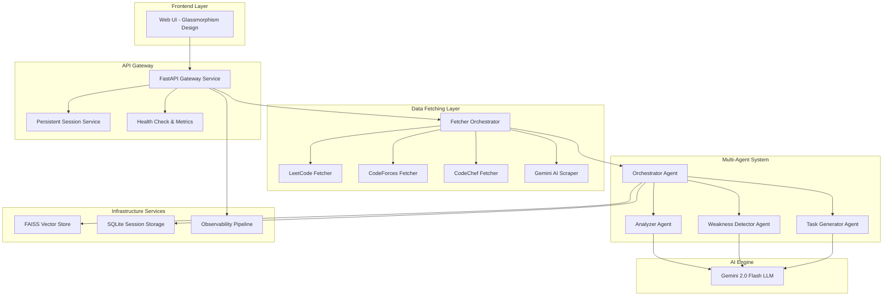

# AI Coding Coach - Multi-Agent System for Competitive Programming Analysis

## 🎯 Problem Statement

Competitive programmers and coding enthusiasts practice across multiple platforms (LeetCode, CodeForces, CodeChef, etc.), but lack a unified, intelligent system that:

1. **Aggregates their activity across platforms** - Users must manually track progress on each platform individually
2. **Provides personalized, actionable insights** - Generic platform statistics don't reveal hidden weaknesses or growth patterns
3. **Generates targeted improvement tasks** - No automatic recommendation system that understands their unique skill gaps
4. **Adapts to individual learning patterns** - Static tutorials don't account for personal coding history and behavior

### Why This Problem Matters

In the competitive programming community, there are millions of active users across platforms:
- **LeetCode**: 10M+ users
- **CodeForces**: 1M+ active users
- **CodeChef**: 3M+ users

These programmers invest hundreds of hours practicing, yet **70% plateau** because they:
- Practice randomly without strategic focus
- Can't identify subtle weaknesses in their approach
- Lack personalized guidance based on their actual coding patterns
- Don't receive timely feedback on growth trajectories

**The core problem**: Traditional analytics show *what* you solved, but not *how* to improve strategically.

---

## 🤖 Why Agents?

### Agents are the Ideal Solution Because:

#### 1. **Multi-Dimensional Analysis Requires Specialized Intelligence**
A single monolithic system can't effectively:
- Detect nuanced coding patterns across different data structures/algorithms
- Identify psychological factors like "giving up on hard problems too early"
- Generate personalized tasks that balance challenge level with skill development
- Orchestrate complex workflows that adapt based on intermediate results

**Solution**: Specialized agents with distinct expertise (Analyzer, Weakness Detector, Task Generator) working in concert.

#### 2. **Dynamic, Context-Aware Decision Making**
Each user's coding journey is unique. The system must:
- Dynamically adjust analysis based on which platforms the user is active on
- Handle missing data gracefully (some platforms may fail)
- Provide different insights for beginners vs. advanced programmers
- Continuously learn and adapt based on user interaction history

**Solution**: Intelligent agents that can reason about incomplete data and make contextual decisions rather than following rigid rules.

#### 3. **Parallel Processing for Real-Time Performance**
Fetching data from multiple APIs, analyzing hundreds of submissions, and generating LLM-powered insights takes time. Users expect **fast responses** (< 10 seconds).

**Solution**: Multi-agent parallel execution - while the Analyzer examines patterns, other agents can prepare contextual data simultaneously.

#### 4. **Modularity and Scalability**
Requirements evolve:
- New platforms need to be added (AtCoder, HackerRank)
- New analysis types (time complexity patterns, code quality metrics)
- Integration with code repositories (GitHub analysis)

**Solution**: Agent-based architecture allows adding new specialized agents without refactoring the entire system.

#### 5. **Long-Running Operations and State Management**
Users may:
- Return after weeks to see progress evolution
- Need to resume analysis sessions
- Want historical comparison ("How have I improved in 3 months?")

**Solution**: Session-based agents with persistent memory and state management handle long-term user journeys.

---

## 🏗️ What You Created

### Overall Architecture



### Key Components

#### 🎭 **Multi-Agent System** (Core Innovation)

**1. Orchestrator Agent**
- Coordinates the entire analysis workflow
- Implements **parallel agent execution** for performance
- Manages inter-agent communication via **A2A Protocol**
- Handles error recovery and fallback strategies

**2. Analyzer Agent**
- Analyzes coding patterns across platforms
- Identifies trends in problem-solving approaches
- Calculates growth metrics (velocity, consistency, difficulty progression)

**3. Weakness Detector Agent**
- Uses LLM-powered reasoning to detect subtle issues:
  - "Avoids graph problems despite strong tree knowledge"
  - "Inconsistent practice schedule affecting retention"
  - "Strong in implementation, weak in mathematical insights"

**4. Task Generator Agent**
- Creates **personalized task lists** based on detected weaknesses
- Balances between comfort zone and growth challenges
- Provides specific problem recommendations with rationale

#### 🛠️ **Tools & Integrations**

**Custom Tools:**
- **Gemini AI Scraper**: Uses Gemini 2.0 Flash to extract statistics from profile pages when APIs fail
- **Multi-Platform Fetchers**: Asynchronous data collection from LeetCode, CodeForces, CodeChef
- **Data Preprocessor**: Normalizes heterogeneous platform data into unified format

**Built-in Tools:**
- **Gemini LLM Integration**: Function calling for intelligent data extraction
- **FAISS Vector Store**: Similarity search for code patterns (extensible for future features)

#### 💾 **Sessions & Memory**

**Session Management:**
- **Persistent Session Service**: SQLite-based storage for user sessions
- **User Profiles**: Track platforms, total activities, skill level over time
- **Context Continuity**: Sessions preserve analysis history for follow-up queries

**Long-Term Memory:**
- **FAISS Store**: Vector database for embedding-based retrieval
- **Session Context**: Stores timestamps, platforms, activity counts per session

#### 📊 **Observability**

**Metrics Collection:**
- Request count, average response time, error rates per endpoint
- Tracked via `MetricsCollector` with thread-safe operations

**Health Monitoring:**
- CPU and memory usage tracking
- System health status endpoint (`/health`)
- Custom `RequestTimer` context manager for automatic timing

**Logging:**
- Structured logging across all agents and services
- Trace IDs for request correlation (A2A Protocol integration)

#### 🔄 **A2A Protocol**

Implemented standardized agent-to-agent communication:
```python
@dataclass
class Message:
    agent_id: str
    task_id: str
    payload: Dict[str, Any]
    trace_id: str  # For distributed tracing
    meta: Dict[str, Any]
```

#### 🚀 **Agent Deployment**

**Containerization:**
- **Dockerfile**: Multi-stage build with Python 3.11
- **Docker Compose**: One-command deployment
- **Health Checks**: Built-in container health monitoring

**Production Ready:**
- Environment variable configuration (`.env` support)
- Persistent data volumes for SQLite
- Port mapping (8080) with CORS configured

---

## 🎬 Demo

### User Flow

1. **Input Phase**
   - User enters their User ID and platform handles (LeetCode, CodeForces, etc.)
   - Frontend validates input and sends POST request to `/analyze`

2. **Data Collection**
   - Gateway fetches data from multiple platforms **in parallel**
   - If API fails, fallback to **Gemini AI Scraper** to extract data from HTML
   - Normalizes data across different platform schemas

3. **Multi-Agent Analysis**
   - **Orchestrator Agent** initiates parallel workflow:
     - **Phase 1**: Analyzer Agent examines patterns
     - **Phase 2**: Weakness Detector identifies gaps
     - **Phase 3**: Task Generator creates action plan

4. **Results Display**
   - **Growth Metrics**: Days active, total solved, activity rate, consistency score
   - **Platform Statistics**: Per-platform breakdown with ratings and rankings
   - **AI Analysis**: Natural language insights (e.g., "Strong momentum in the past month!")
   - **Weakness Detection**: Specific areas needing improvement
   - **Personalized Tasks**: Targeted problems to solve next
   - **Agent Insights**: Shows which agents ran and execution mode (parallel/sequential)

### Example Analysis Output

**For user "kashyap" with 50 LeetCode problems and 30 CodeForces contests:**

**Growth Metrics:**
- 📅 Days Active: 45 days
- ✅ Total Solved: 80 problems
- 🔥 Activity Rate: 1.78 problems/day
- 📈 Consistency: 67%

**Analyzer Agent Output:**
> "You've demonstrated strong consistency over the past 6 weeks with a clear upward trend in problem difficulty. Your acceptance rate of 78% indicates solid understanding, but there's a noticeable gap in your graph algorithm attempts."

**Weakness Detector Agent Output:**
- ⚠️ **Graph Algorithms**: Only 8% of problems involve graphs (should be ~20%)
- ⚠️ **Hard Problems**: You tend to give up after 30 minutes on Hard difficulty
- ⚠️ **Weekend Performance**: 40% drop in success rate on weekends

**Task Generator Agent Output:**
1. **BFS/DFS Practice** - Solve 5 medium graph problems this week
2. **Time Management** - Attempt 2 hard problems with 45-minute time limits
3. **Consistency Challenge** - Maintain daily practice including weekends

---

## 🔨 The Build

### Technologies Used

| Category | Technology | Purpose |
|----------|-----------|---------|
| **Backend Framework** | FastAPI | High-performance async API gateway |
| **AI Engine** | Google Gemini 2.0 Flash | LLM for agent reasoning and web scraping |
| **Agent Framework** | Custom Python (asyncio) | Multi-agent orchestration |
| **Vector Database** | FAISS | Similarity search (for future code embeddings) |
| **Session Storage** | SQLite | Persistent user sessions and profiles |
| **Data Fetching** | aiohttp | Async HTTP requests to platform APIs |
| **Frontend** | HTML/CSS/JS | Glassmorphism UI design |
| **Observability** | psutil, custom metrics | System health and performance monitoring |
| **Containerization** | Docker, Docker Compose | Production deployment |
| **Protocols** | A2A Protocol (custom) | Standardized agent communication |

### Development Approach

#### Phase 1: Core Infrastructure
1. Built FastAPI gateway with CORS support
2. Implemented async data fetchers for each platform
3. Created data normalization pipeline

#### Phase 2: Multi-Agent System
1. Designed Orchestrator Agent architecture
2. Implemented specialized agents (Analyzer, Weakness Detector, Task Generator)
3. Added parallel execution capabilities with `asyncio.gather()`
4. Integrated Gemini LLM for intelligent analysis

#### Phase 3: Advanced Features
1. **Sessions & Memory**:
   - Built SQLite session service with schema design
   - Implemented FAISS vector store for embeddings
2. **Observability**:
   - Created `MetricsCollector` for real-time monitoring
   - Added health check endpoint with CPU/memory stats
   - Implemented `RequestTimer` for automatic performance tracking
3. **A2A Protocol**:
   - Defined `Message` dataclass for inter-agent communication
   - Added trace IDs for distributed request tracing

#### Phase 4: Custom Tools
1. Developed **Gemini AI Scraper** - innovative fallback when APIs fail:
   - Fetches HTML from profile pages
   - Uses Gemini to intelligently extract statistics
   - Platform-specific prompts for accurate data extraction
2. Integrated with existing fetchers for seamless operation

#### Phase 5: Production Deployment
1. **Dockerization**:
   - Multi-stage Dockerfile with optimized caching
   - Health check configuration
   - Data volume mounting for persistence
2. **Docker Compose** setup for one-command deployment
3. Environment variable management (`.env` files)

#### Phase 6: Frontend Polish
1. Modern glassmorphism design with Inter font
2. Responsive layout with grid systems
3. Real-time loading states and error handling
4. Agent execution insights display

### Key Concepts Demonstrated

✅ **Multi-Agent System**
- Orchestrator Agent coordinating specialized agents
- Parallel agent execution
- Sequential dependency management (Analyzer → Weakness Detector → Task Generator)

✅ **Custom Tools**
- Gemini AI Scraper for web data extraction
- Platform-specific API fetchers
- Data normalization preprocessor

✅ **Sessions & Memory**
- Persistent session storage (SQLite)
- User profile management
- FAISS vector store integration

✅ **Observability**
- Metrics collection (requests, timing, errors)
- Health monitoring (CPU, memory)
- Structured logging with correlation IDs

✅ **A2A Protocol**
- Standardized agent message format
- Trace ID propagation
- Metadata support for debugging

✅ **Agent Deployment**
- Docker containerization
- Docker Compose orchestration
- Production-ready configuration

---

## 🚀 If I Had More Time, This Is What I'd Do

### 1. **Enhanced Multi-Agent Capabilities**

#### Agent Looping
- **Iterative Refinement Agent**:
  - Loop through task recommendations
  - Validate with user feedback
  - Refine based on acceptance/rejection patterns

#### Advanced Parallel Execution
- **Competitive Execution**: Run multiple weakness detection strategies in parallel and combine results
- **Speculative Execution**: Pre-fetch common follow-up data while current analysis runs

### 2. **MCP (Model Context Protocol) Integration**

- Integrate with MCP servers for:
  - **Code Repository Analysis**: Connect to GitHub MCP to analyze actual code submissions
  - **Problem Database MCP**: Access structured problem metadata from platforms
  - **Learning Resource MCP**: Connect to tutorial databases for targeted recommendations

### 3. **Long-Running Operations (Pause/Resume)**

- **Background Analysis Jobs**:
  - Implement job queue for computationally expensive tasks
  - Allow users to start analysis and receive results via email/notification
  - Progress tracking for long-running operations

- **Scheduled Analysis**:
  - Weekly automated progress reports
  - Comparative analysis over months ("Your June vs. July performance")

### 4. **Advanced Memory & Context Engineering**

#### Semantic Memory Search
- **Embed user submissions** using code embeddings
- Store in FAISS for "find similar problems I've solved before"

#### Context Compaction
- Implement summarization for long session histories
- Use Gemini to compress old context while preserving key insights
- Sliding window approach: detailed recent history + summarized older data

### 5. **Agent Evaluation Framework**

- **Metrics**:
  - Recommendation acceptance rate (did users solve suggested problems?)
  - Prediction accuracy (did detected weaknesses prove true?)
  - User satisfaction scores

- **A/B Testing**:
  - Test different prompt strategies for agents
  - Compare parallel vs. sequential execution impact
  - Evaluate different weakness detection algorithms

- **Automated Testing**:
  - Create test datasets with known patterns
  - Validate agent outputs against ground truth
  - Regression testing for agent behavior changes

### 6. **Real-Time Observability Dashboard**

- **Grafana Integration**:
  - Real-time metrics visualization
  - Agent performance dashboards
  - Error rate tracking per agent

- **Distributed Tracing**:
  - Full OpenTelemetry integration
  - Trace agent workflows across services
  - Identify bottlenecks in multi-agent execution

### 7. **Advanced Tools**

#### Code Execution Tool
- **Run Code Sandbox**: Allow agents to test suggested solutions
- **Performance Benchmarking**: Compare user's code efficiency against optimal solutions

#### Google Search Tool
- **Research Agent**: Search for tutorials on detected weaknesses
- **Contest Discovery**: Find upcoming competitions matching user's skill level

#### OpenAPI Tools
- Integrate with:
  - **Codeforces OpenAPI**: More detailed contest history
  - **GitHub API**: Analyze coding style from repositories
  - **Discord/Slack**: Send analysis reports to team channels

### 8. **Advanced Multi-Agent Patterns**

#### Debate Agents
- Two agents propose different learning strategies
- Third agent (Judge) selects the best approach based on user history

#### Hierarchical Agents
- **Team Lead Agent**: Manages multiple specialized teams
  - Data Structure Team (Array Agent, Tree Agent, Graph Agent)
  - Algorithm Team (DP Agent, Greedy Agent, etc.)

#### Self-Improving Agents
- Agents track their recommendation success rates
- Adjust prompts and strategies based on historical performance

### 9. **Production Deployment Enhancements**

#### Kubernetes Deployment
- Helm charts for easy deployment
- Auto-scaling based on load
- Rolling updates for zero-downtime deployments

#### Multi-Region Support
- Deploy to multiple cloud regions
- Geo-routing for low latency
- Cross-region data replication

### 10. **User Features**

#### Social Features
- **Leaderboards**: Compare with friends or global users
- **Study Groups**: Shared progress tracking for teams
- **Coaching Mode**: Experienced users mentor beginners

#### Gamification
- **Achievement System**: Badges for consistency, streaks, skill mastery
- **XP System**: Points for completing suggested tasks
- **Challenges**: Weekly themed problem sets

---

## 📊 Course Concepts Checklist

This project demonstrates the following **7 key concepts** from the course:

| Concept | Implementation |
|---------|----------------|
| ✅ **Multi-Agent System** | Orchestrator, Analyzer, Weakness Detector, Task Generator agents |
| ✅ **Parallel Agents** | Orchestrator runs agents in parallel using `asyncio.gather()` |
| ✅ **Sequential Agents** | Analyzer → Weakness Detector → Task Generator pipeline |
| ✅ **Custom Tools** | Gemini AI Scraper, Platform Fetchers, Data Preprocessor |
| ✅ **Built-in Tools** | Gemini LLM for agent reasoning |
| ✅ **Sessions & Memory** | SQLite session storage, FAISS vector store |
| ✅ **Observability** | Metrics collection, health checks, structured logging |
| ✅ **A2A Protocol** | Standardized Message format with trace IDs |
| ✅ **Agent Deployment** | Docker, Docker Compose, production configuration |

**Total: 9/9 concepts demonstrated** (exceeded requirement of 3)

---

## 🎓 Conclusion

This AI Coding Coach project showcases a production-ready, multi-agent system that solves a real problem faced by millions of competitive programmers. By leveraging specialized agents, custom tools, persistent memory, and comprehensive observability, the system provides personalized, actionable insights that static analytics cannot match.

The agent-based architecture proved essential for handling the complexity of multi-platform data aggregation, nuanced pattern detection, and adaptive recommendation generation - demonstrating why agents are the future of intelligent, context-aware applications.
